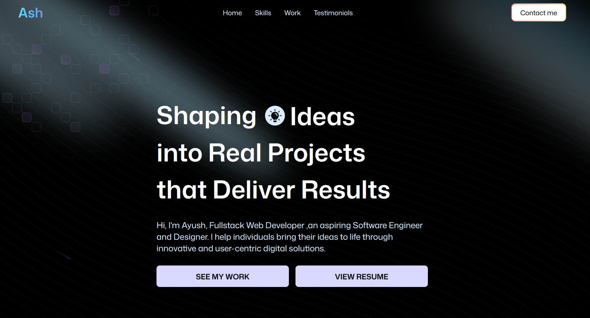

# 🌐 My Portfolio Website

Welcome to my personal portfolio!  
This website showcases my **projects**, **skills**, and **experience** as a web developer 🚀  

👉 **[Live Demo](https://ash-portfolio-three-delta.vercel.app)**  
📦 **Repository:** [GitHub Repo](https://github.com/GitH22Ash/Ash_Portfolio)

---

## ✨ Features

- ⚡ Built with **React + Vite** for blazing-fast performance  
- 🎨 Styled with **Tailwind CSS** for a modern and responsive design  
- 🌙 Styling components from Aceternity UI 
- 🧩 Modular components for easy scalability  
- 📱 Fully responsive across all devices  
- 💌 Integrated contact section / form  
- 🖼️ Smooth animations and transitions

---

## 🛠️ Tech Stack

| Category | Technologies |
|-----------|--------------|
| **Frontend Framework** | React (with Vite) ⚛️ |
| **Styling** | Tailwind CSS 🎨 |
| **Animations** | Framer Motion / CSS Transitions ✨ |
| **Deployment** | Vercel 🌍 |
| **Version Control** | Git + GitHub 🧑‍💻 |

---

## 📸 Preview

> *Screenshot of the portfolio website homepage*

---
## 💬 Contact

---

## 🧾 License

This project is licensed under the **MIT License** – see the [LICENSE](./LICENSE) file for details.

---

⭐ **If you like this project, don’t forget to [star the repo](https://github.com/GitH22Ash/Ash_Portfolio) !**

